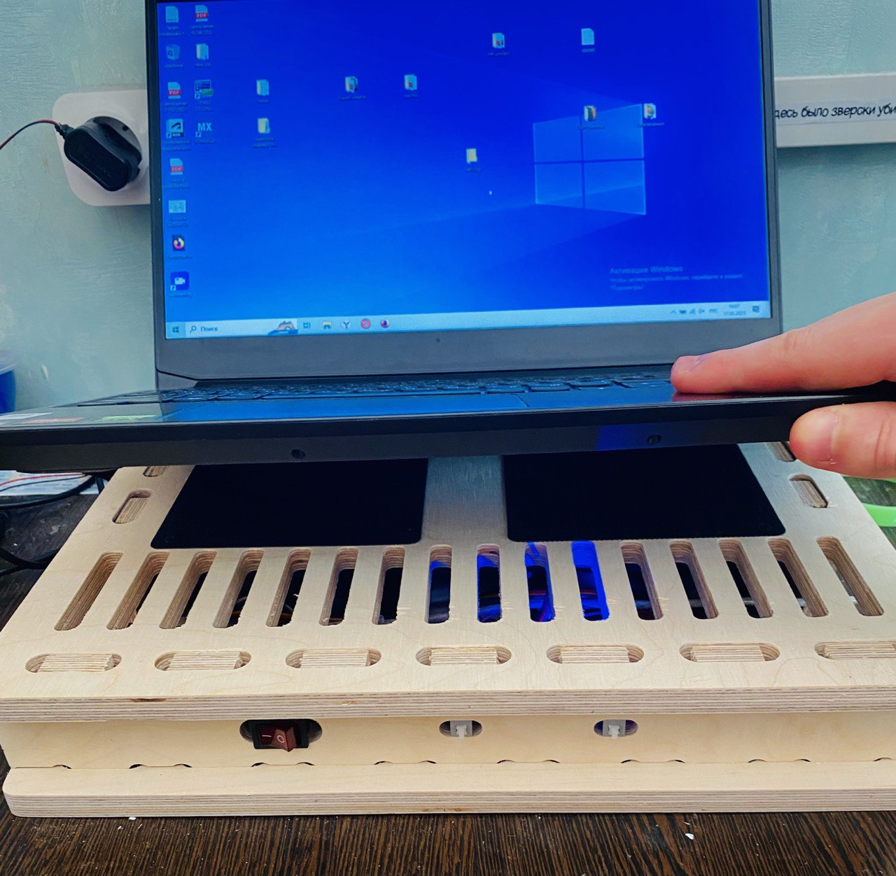
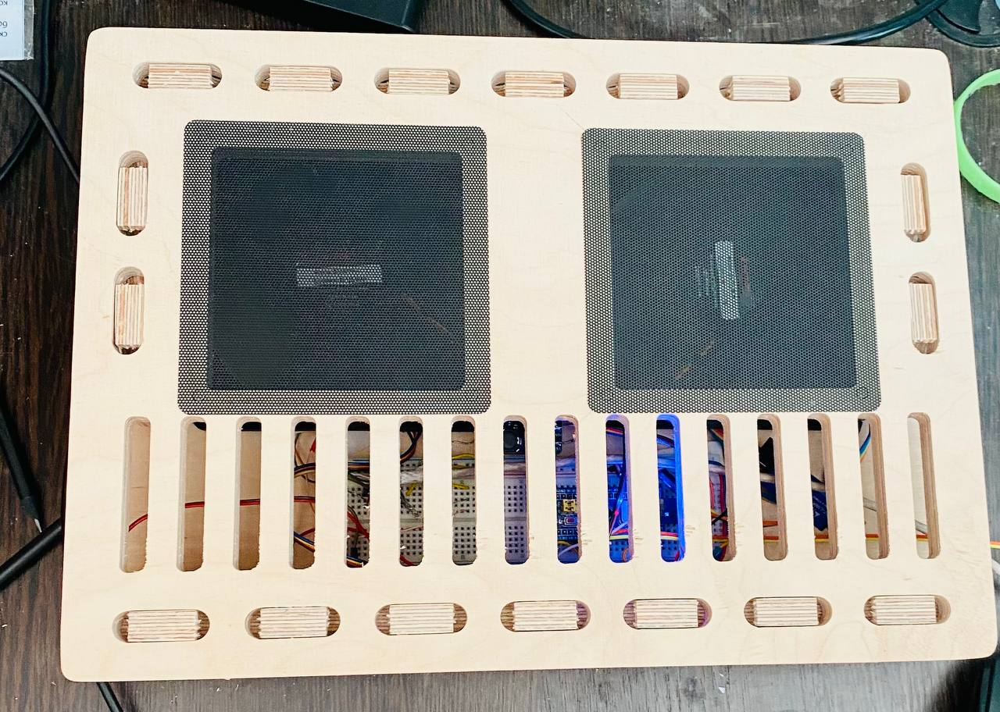

# PRO-laptop-stand
Group project for the 4th semester at MIPT in the framework of the additional course "Design, prototyping and production in project format"

---
Authors: Nikita Ozerov https://github.com/nik0zer, Alexey Zhelyapov https://github.com/alexzhelyapov1, Maria Klimenteva https://github.com/MariaKlimenteva

---
##### PRODUCT BRIEF DESCRIPTION
The created device is a cooling stand for a laptop. Fans cool well, make noise unobtrusively, allow you to change the cooling mode. Main material used : plywood.

##### PURPOSE OF THE DEVICE
The task performed by the project is to cool the laptop, and the device also acts as a stand so that the screen is at eye level.

---
##### ORIGINALITY OF THE DEVICE
+Made of wood, combines several functions at once
+It is quite easy to scale into a pc in a desktop, you can make a pc case in this way
+All together, it is quite cheap and did not take much time in production, if you do not take into account the process of developing ideas and mistakes that we sometimes made and then corrected
- ###### Analysis of existing analogues and formulation of distinctive features of the project:

There are analogues of our product. Most of them are made of plastic, sometimes aluminum or metal alloys. Unlike analogues, we chose plywood as the main material.

Stands made of wood also exist in commercial production, however, they are usually without fans and perform only one function - the correct position of the laptop with a slight tilt.

Our product is multifunctional: it serves as a stand, allowing you to keep the laptop screen at eye level and keep the laptop itself slightly above the table, and also actively cools the heating bottom part.

---
- ###### Description of the product design and manufacturing process:
    - made models of parts
    - the body was cut out
    - we polished it
    - wrote the code
    - collected and tested everything

- ###### Description of the product testing process and analysis of its results:
---
##### COMPONENTS, TOOLS, MACHINES
- To cut the stand, we used a milling machine (models and drawings can be found in the project files)
- 

##### THE PROBLEMS WE FACED WITH
The problem occurred when transferring from solidworks to autodesk artcam (in the dimension space comparison).

##### DEVICE PHOTO
  

##### VIDEO PRESENTATION 